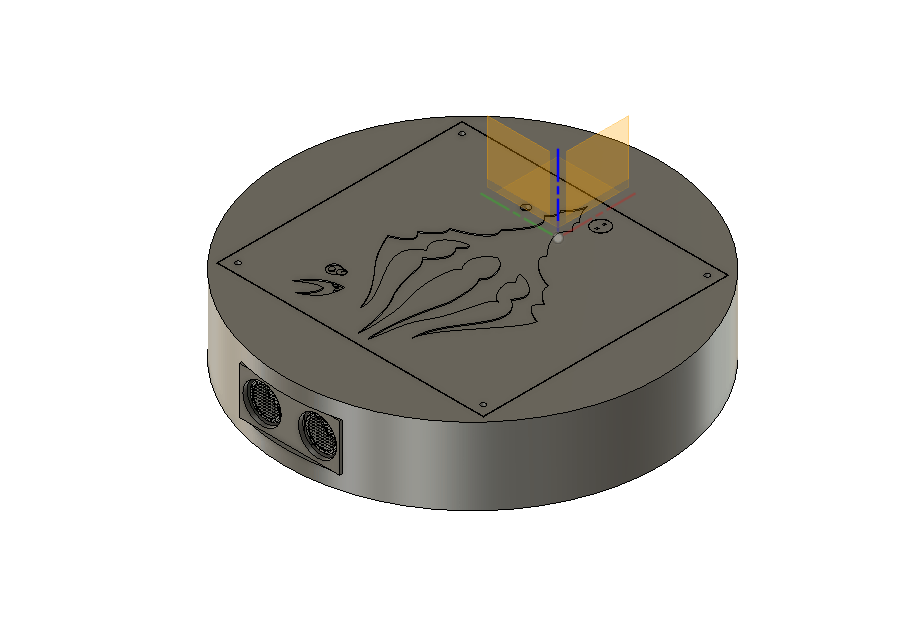
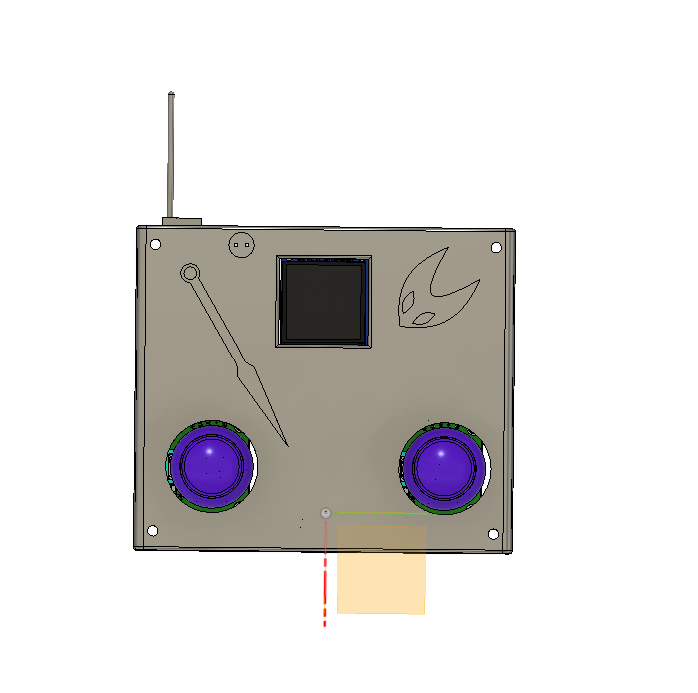

# Kings Roomba

    Kings Roomba isnt a Roomba (shocking).
    Kings Roomba is just a simple remote controlled robot that looks like a Roomba cuz i suck at 3d modeling and has a ultrasonic sensor.

## Features:
    - 4 Wheels - Robot
    - Ultrasonic Sensor - Robot
    - KINGS BRAND FROM HOLLOW KNIGHT - Robot
    - 3000mah Battery (Around 3-4 hours of continuous use) - Robot
    - TFT Display - Controller
    - Joysticks for full control of both wheel groups - Controller
    - 400mah Battery (Still like 3 hours of use) - Controller
    - LIL TENNA (Delarune Reference??????)
    - HORNET AND HER NEEDLE - Controller

## Robot Model:
    Everything fits together using Screws and Brass inserts. It uses M2, M2.5 and M3 Screws and Inserts
    It has a bazzilion pieces including:
    - Main Body
    - Middle Plate
    - Top Plate
    - Whells x 4
    - Brackets x 4

Made in Fusion360. Cuz i am broke and its freee

## Controller Model
    Its less stuff to digest then the actual robot, only needing 3 parts and a couple of Brass inserts and screws.
    The only parts you need are:
    - Bottom Piece
    - Top Piece
    - LIL TENNA (optional)

    LIL TENNA might be optional but dont you dare not print it!!

## PCB AND SCHEMATIC
    IT DONT GOT ONE AND IT DONT NEED ONE CUZ I KNOW WHAT I GOT!!
    in other words you only need a few dupon wires to build it, all parts are either screwed together or lodged in their one nifty room so no need to worry about them getting loose.

## Firmware Overview
    Its Just ArduinoIDE ig.

    - The Screen is to display wether the motor are spinning to the front or back
    - Both ESP talk together using ESP NOW

## BOM:
    Here should be everything you need to make this one of a kinda Kings Roomba to clean up your White Palace Runs

    - 2x Xiao ESP32 S3
    - 1x 1.3 inch TFT Display
    - 1x Keystudio Motor Driver
    - 2x Joystick Modules
    - 4x DC Motors
    - 1x Ultrasonic Senor (HC-SR04)
    - 1x 3000mah 18650 Cell
    - 1x Cell Holder
    - 1x 400mah Lipo Battery
    - 2x Switches
    - Brass Inserts
    - 0x PCB cuz it dont need one
    - 14x Printed Pieces

## Extra stuff
 Firstly Thanks for Reaching the end of the READ ME, that means a lot to me.
 This was my 3rd project I did and I am really happy how it turned out.
 One last thanks is to everyone at Stardance and Hackclub who gave me the chance to do this.