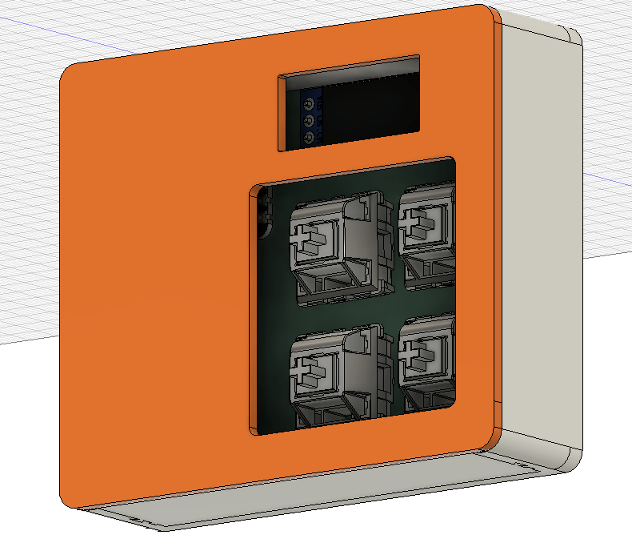
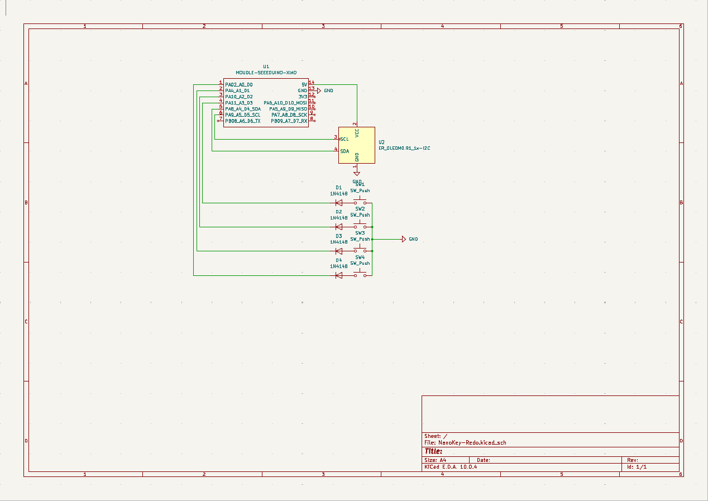
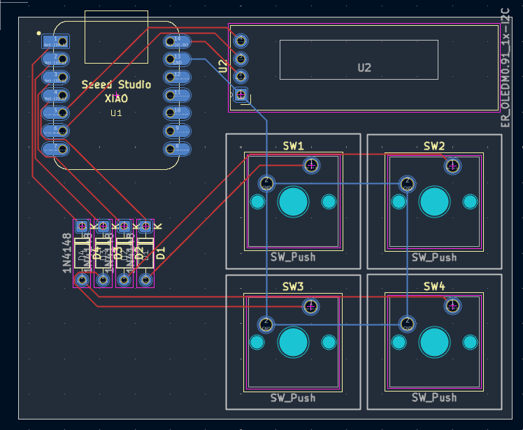

# NanoKey

Nanokey is a 4 key macropad with an OLED Display. It also uses QMK firmware

PS: All images of the PCB, CAD and Schematics are on the assets folder if u wanna see.

## Features:
- 128x32 OLED Display
- 4 Keys

## CAD Model:
Everything fits together using dovetail joints so there is no need for screws or glue!
It has 3 separate printed pieces. The main part consisting of the bottom, back and side walls. The secondary part consisting of the front wall. The Last part consistiong of top part of the case.

Made in Fusion360. Nifty

## PCB
It was made in KiCad. Only needing to add Kicad Care package Symbols and Footprints.
All 3D models were found on GrabCad

I used MX_V2 for the keyswitch footprints.

**Schematic:**

**PCB Layout:**

## Firmware Overview
This hackpad uses [QMK](https://qmk.fm/) firmware for everything. 

- The 4 keys currently act as macros
- The OLED is supposed to be a Ram stick, cuz im kinda broke on ram :(

## BOM:
Here should be everything you need to make this hackpad

- 4x Cherry MX Switches
- 4x DSA Keycaps
- 4x 1N4148 DO-35 Diodes.
- 1x 0.91" 128x32 OLED Display
- 1x XIAO RP2040
- 1x Case (3 printed parts)

## Extra stuff
Honestly this was my first ever project, i never touched CAD besides TinkerCAD in school and never made a PCB in my life.
With that expect a bunch of errors and stuff but it was fun to build it and learn as I built!